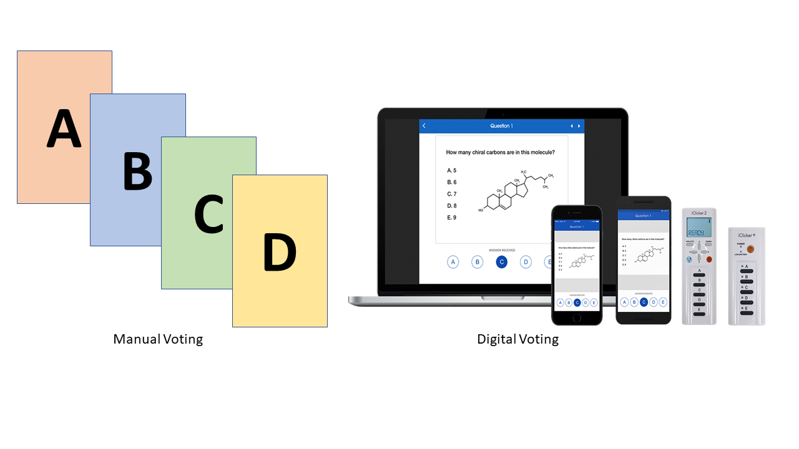
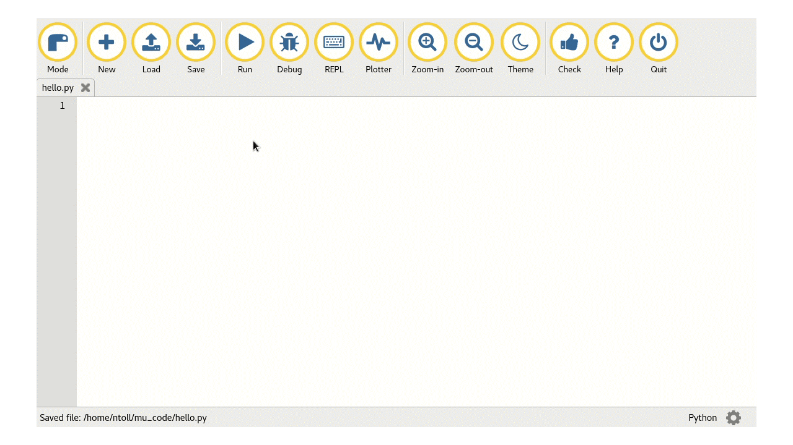

## Technical setup

In all of the 12 lessons, pupils will have the chance to vote for the correct answer in response to the multiple choice questions (MCQs). Before you begin the project, it will be important to choose a voting system that you will use in all of the lessons. You can do this manually, using coloured cards or mini whiteboards for pupils to hold up to show their answers. Using a manual system can be good if digital systems are not available, or if you feel that the use of digital systems or web-based quizzes is not suitable for your pupils. However, it can be more difficult for you to assess which misconceptions are most common amongst your pupils. 

 

Digital voting systems, such as clickers or web-based quizzes, have the advantage of providing an automated aggregation of pupil responses. You are able to share graphs of the class answers, if you choose to, and quickly assess which misconceptions your pupils hold. However, these tools can make the MCQ cycle feel more like a summative test, and may lead to a greater focus on getting the correct answer, rather than developing understanding and engagement with the topic. Relying on these tools can also cause problems if they stop working or have setup issues during the lesson. It is important to consider these factors when choosing which voting system you will use for the 'Peer Instruction' project.

## Programming tools

In Unit 2 – Python programming, you will need to select a development environment. You can use a local installation of a Python interpreter and a learner-friendly IDE such as the [Mu editor](https://codewith.mu/), or you can use an online development environment such as [Repl.it](https://repl.it/). You could also use both, but that may be confusing for pupils. The [Project Guide](https://docs.google.com/document/d/17sTwXM-oZx3GL-rG6Ctglfqg-ONAW9SaB6p--2Vj99s/edit) includes some questions to consider when making this decision.

## Additional resources

As you go through the lesson plans later in this course, you will notice that some lessons require additional resources for some of the unplugged activities. For example, in Unit 1 – Lesson 2, pupils are asked to communicate in code using different types of devices (such as lights, musical instruments, paper, etc.). It is important that you read through the lesson plans carefully and identify any additional resources that you will need. 
 
Click the green button (below right) to go to the next step in this session.

You can go back to the [list of contents for this session (Session 2) here](https://projects.raspberrypi.org/en/projects/gbic-peer-instruction-2).
You can access the [menu for Sessions 1 and 2 here](https://projects.raspberrypi.org/en/pathways/gbic-peer-instruction-training).
