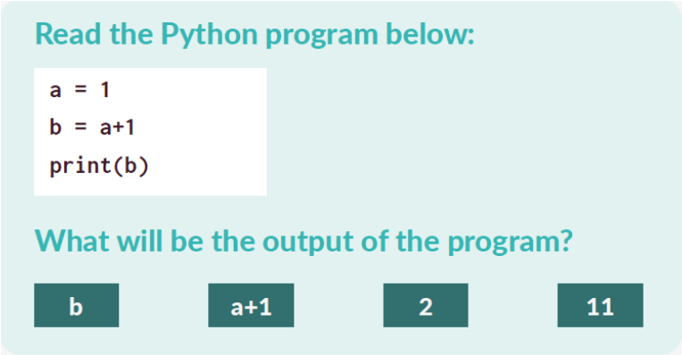

## Multiple Choice Questions in Peer Instruction

In the animation you saw in Session 1, you were shown this example of an Multiple Choice Question (MCQ)

--- task ---
Can you identify why the other answers are incorrect? Write down which key misconception a pupil would have if they chose each of the incorrect answers. 

(provide misconceptions to un-hide)
--- /task ---

## Write your own question

--- task ---
Now that you have seen an MCQ that can be used in Peer Instruction, can you write your own?

Use a Year 8 unit of work that you are familiar with and identify a key concept that pupils need to understand in that unit. Remember that the question must address only one concept and that your incorrect answers must all represent a misconception associated with that concept. It might help to think about questions or common mistakes that you have encountered when teaching this unit. Remember the following principles for writing good MCQS:
+ Each incorrect answer should identify a single misconception
+ Questions must be achievable and possible to answer quickly. Don’t make them too hard
+ Make sure the tense and grammar of every answer matches the question (for example, don't have a question that refers to a plural and then answers that are singular)
+ Ensure each answer is independent and cannot be eliminated based on anything other than subject knowledge (i.e. don't include 'filler' answers)

--- /task ---

--- task ---
**Reflection activity:** *What did you learn from producing your own MCQ for Peer Instruction?*
--- /task ---

## Extension activity

For pupils who show good understanding early in the process, you can ask them to complete the task you have just done as a challenge or extension. You will find a template provided for this activity in the resources.
+ Can they write an MCQ in which one of the other options would be correct?
+ Can they identify the misconceptions addressed by the incorrect answers?

Click the green button (below right) to go to the next step in this session.

You can go back to the [list of contents for this session (Session 1) here](https://projects.raspberrypi.org/en/projects/).
You can access the [menu for Sessions 1, 2, and 3 here](https://projects.raspberrypi.org/en/).
